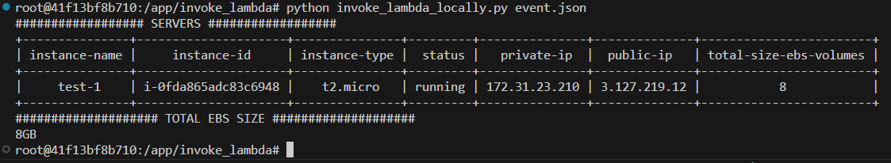
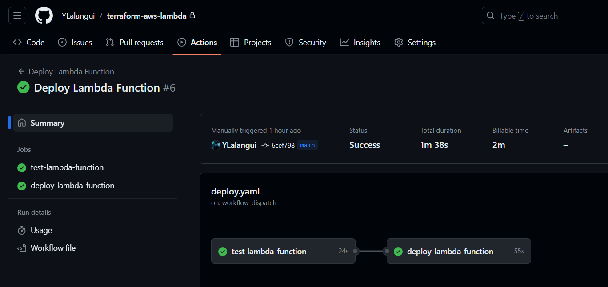
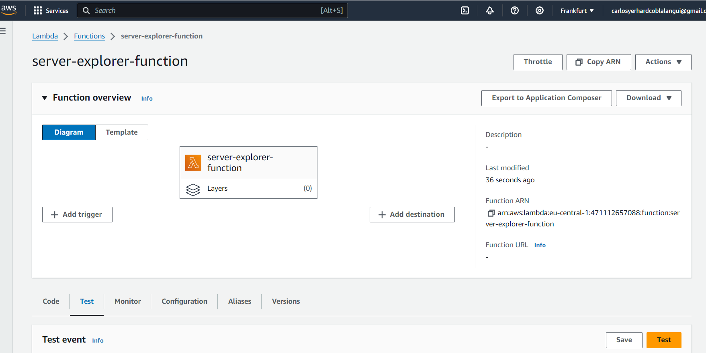

# terraform-aws-lambda

In this documentation, we'll guide you through the entire process of working with a lambda function, from beginning to end, within AWS. It includes an overview of the repository's structure, steps to develop a lambda function using a devcontainer (testing included), and methods for deploying the lambda. Deployment can be achieved in two ways: by running a terraform script to deploy the lambda in an AWS environment, and by pushing code to GitHub actions to activate a workflow on GitHub runners.

# 1. Repository structure
### Devcontainer
We'll go through what's in this repository, step by step. We started by developing the lambda in a separate, containerized space using devcontainer. The file `.devcontainer/devcontainer.json` shows the setup we used to begin making our lambda. This setup is really helpful because it comes with some great tools already included, even python libraries which our lambda will use. For instance, whenever you save a file with `ctrl+s`, tools like `isort` and `black` automatically format your code. Inside devcontainer, you can also add extras like Git connections, tools to tidy up terraform files, or even GitHub Copilot. And you don't have to worry about AWS credentials; they're securely included in our container through the "mounts" section, which helps keep everything safe and leak-free.

### Github Actions
We've set up CI/CD pipelines to manage the lambda in AWS, making it easy to put it up and take it down when needed. There's a `deploy.yaml` file that does two things: it first runs automated tests, and if those tests pass, it goes ahead with the deployment. Also, we have a `destroy.yaml` file that's used to remove the lambda from our AWS environment.

### deploy_lambda folder
If we're ever unable to use CI/CD pipelines (like GitHub Actions, GitLab CI, Jenkins, etc.), we've prepared a folder with two scripts that mimic these pipelines. The first script, `deploy_lambda_manually_terraform.sh`, contains all the steps to package the lambda and deploy it using terraform. The second script, `destroy_lambda_manually_terraform.sh`, includes commands to remove the lambda from our AWS setup. If you look closely, you'll notice that the commands in the `.github` folder and those in the `deploy_lambda` folder are quite similar.

### invoke lambda folder
Even after we've finished developing our lambda or it's already deployed, it's important to check if our lambda is accessible and working as expected. We have two scripts in this folder for testing our lambda both locally and remotely. If you're still in the development phase and want to test your lambda locally, you can run the `invoke_lambda_locally.py` script. On the other hand, if your lambda is deployed and you want to see if it's reachable on AWS, you can use the `invoke_lambda_remote.py script`. Remember to check the `event.json` file and adjust the lambda input as needed to properly test your lambda.

### src folder

In this folder, you'll find the code for our lambda. This lambda is designed to search through servers in our AWS environment and provide us with details. It organizes information by the total size of EBS volumes attached, covering things like instance name, instance ID, or their status. The lambda gives us two main outputs: a table listing all servers according to the criteria we set (like tag name, '*', prefix, etc.) and the total size of all EBS volumes (in GB) for the servers shown in the table, summed up into a single number. We'll go over how to run this lambda in later sections.

### terraform folder

In this section, there's just one file, `main.tf`, that outlines our resources and infrastructure using code. It's straightforward as it only sets up two things: the backend (where we'll use S3 as a remote backend to store our infrastructure's state) and the lambda function itself. This file is essential for both the GitHub Actions deployment process and the manual deployment found in the `deploy_lambda` folder.

### test folder

To fully understand and manage our code's lifecycle, it's important to include at least one test. Although it might be a basic test, it's designed to simulate the creation of an AWS EC2 instance. This way, we can check that our lambda functions as intended by testing it with various inputs and expected outputs. This approach helps us cover the simplest scenarios effectively. This code is run by GitHub Actions to check the lambda. If the test passes, then the lambda will be deployed on AWS.

### The "rest" of the scripts

We should also talk about some other key files located at the project's root. One of these is the `Dockerfile`, which `devcontainer` uses to set up our containerized environment for developing the lambda. Besides the `Dockerfile`, there are the poetry files: `poetry.lock` and `pyproject.toml`. These files are crucial in our `devcontainer` environment for managing and installing all the necessary Python libraries required for developing our lambda.

# 2. How to execute the lambda locally

When working with `devcontainer`, it's important to ensure your AWS credentials have the right permissions, at least for listing EC2 servers. This is because, as mentioned earlier, the `devcontainer` environment uses the credentials stored in your local `.aws` folder. You don't need a specific role at this stage since the lambda is run locally. Once your credentials are set up, you're ready to run the lambda. If you're using VSCode, setting up a devcontainer is straightforward – just click on `Reopen in Container`. After you're in the devcontainer, you can proceed to execute:
````
cd invoke_lambda
python invoke_lambda_locally.py event.json
````
Then you will get the result:



If you're not using `devcontainer`, you'll need to create a virtual environment (poetry, virtualenv, etc) and install all the libraries mentioned in the `pyproject.toml` file. After setting up the virtual environment, you can run the two commands we mentioned before. Make sure that your AWS credentials are properly configured with the right permissions to access AWS resources.

# 3. How to deploy the lambda in AWS

Before you can deploy your lambda to AWS, there are a few things you need to set up. First, you'll need to create an S3 bucket to hold the state of your infrastructure (`terraform.tfstate`). After creating the S3 bucket, enter its name on line 3 of the `terraform/main.tf` file, where the `bucket` is specified. This will set a remote backend, so we don't have to keep the infrastructure state on our local machine.

Next, you need to create a role for the lambda to use. This role must have the necessary permissions to at least list the EC2 services and ensure our lambda can function correctly. Write the `ARN` (Amazon Resource Name) of this newly created role into the `terraform/main.tf` file on line 17, where the `role` is defined. This step ensures our lambda has the appropriate permissions within our AWS environment.

Lastly, update the permissions for your AWS credentials. Previously, we adjusted them to list EC2 services for local lambda execution (Section 2). Now, you need to allow the same credentials to put and get objects in the S3 bucket, enabling them to store and manage the state of our infrastructure in AWS (`terraform.tfstate`).

After setting up the necessary AWS permissions, you can deploy your lambda in two ways: through CI/CD pipelines using GitHub Actions or by running bash scripts manually. If you're using GitHub, simply head to the `Actions` tab in your repository and start the deployment pipeline manually. The process begins with tests, and if they pass, your lambda is automatically deployed to AWS. Remember to add GitHub secrets for AWS_ACCESS_KEY_ID and AWS_SECRET_ACCESS_KEY with the correct values. This ensures the pipeline can access these variables and deploy the lambda to the right AWS environment.



If you decide not to use GitHub Actions, you can deploy by running the following locally (Take into account that you need to be in the `devcontainer` or in an environment with all libraries and applications installed. Please take a look at the `Dockerfile` for more information):
````
cd deploy_lambda
./deploy_lambda_manually_terraform.sh
````



# 4. How to test the lambda remotely

After deploying our lambda, we can execute it from our own computer to check if it responds correctly.
For this step, your AWS credentials must be updated to include permissions for invoking a lambda. Just as we've previously updated credentials to access EC2 and S3, we now need to update them once more to add the necessary permissions for lambda invocation. Similar to how we used the `invoke_lambda/invoke_lambda_locally.py` file, we just need to run the following command by using the `invoke_lambda_remote.py`:
````
cd invoke_lambda
python invoke_lambda_remote.py event.json
````
Remember, you should run these commands inside the devcontainer. If you're not using `devcontainer`, make sure you have a virtual environment set up with all the required Python libraries. Take a look at the `pyproject.toml` for more information.


# Conclusions
That's everything! We've gone through the entire lifecycle of our code, from the initial development stages, through testing, and finally to deployment in the AWS environment. This approach centralizes everything we need, making our development and deployment processes faster and more efficient.
